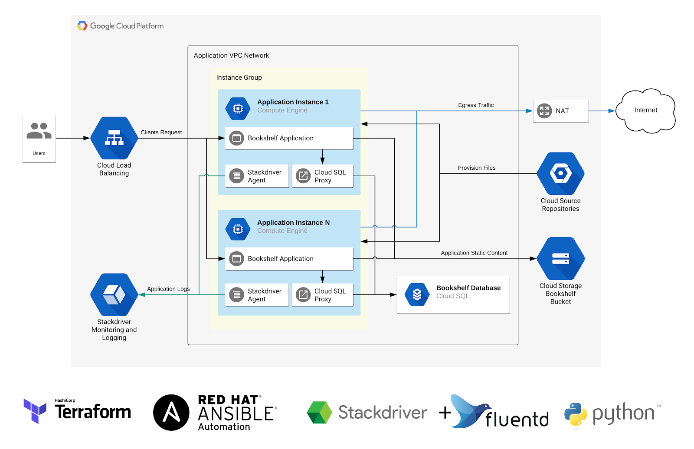

<h1 align="center">Project DevOps</h1>

<h2 align="center">Requirements</h2>

- GCP account
- Terraform
- Ansible

> Note: You should never push your gcp credentials to public and allways destroy resources in cloud after work
---



<h2 align="center">Task Breakdown</h2>

## GCP Console

- Create new project (or use default)
- Create new Service Account for Terraform (or use default)
- Create Cloud Storage bucket for Terraform state file
- Enabe all necessary APIs:
  - [x] Cloud SQL Admin API
  - [x] Cloud Pub/Sub API
  - [x] Service Networking API
  - [x] Cloud Resource Manager API
  - [x] Identity and Access Management (IAM) API

## Terraform

- Use remote state file in separate Cloud Storage bucket
- Create VPC Network
- Create Cloud NAT
- Create SQL instance with private ip
- Create SQL database
- Create Cloud Storage Bucket for Application content
- Create Service Account for Application instance
- Create Instance template (startup-script with vars for [ansible](#ansible))
- Create MIG
- Create firewall rules
- Create HTTP LB

> Optional: Create Terraform Modules

## Ansible

- Install dependencies `git, virtualenv`
- Install Fluentd logging monitor
- Setup SQL Proxy
- Cloning the sample app (this repo)
- Configuring the app config.py
```
  PROJECT_ID={YOUR_PROJECT_ID}
  CLOUDSQL_USER={YOUR_SQL_USER}
  CLOUDSQL_PASSWORD={YOUR_SQL_USER_PASSWORD}
  CLOUDSQL_DATABASE={YOUR_SQL_DATABASE_NAME}
  CLOUDSQL_CONNECTION_NAME={YOUR_SQL_CONNECTION_NAME}
  CLOUD_STORAGE_BUCKET={YOUR_BUCKET_NAME}
```
- Install app dependencies
```
  virtualenv -p python3 env
  source env/bin/activate
  pip install -r requirements.txt
```
- Create tables with command: `python bookshelf/modelcloudsql.py`
- Enable application at startup

> Google [tutorial](https://cloud.google.com/python/tutorials/bookshelf-on-compute-engine) for this python application